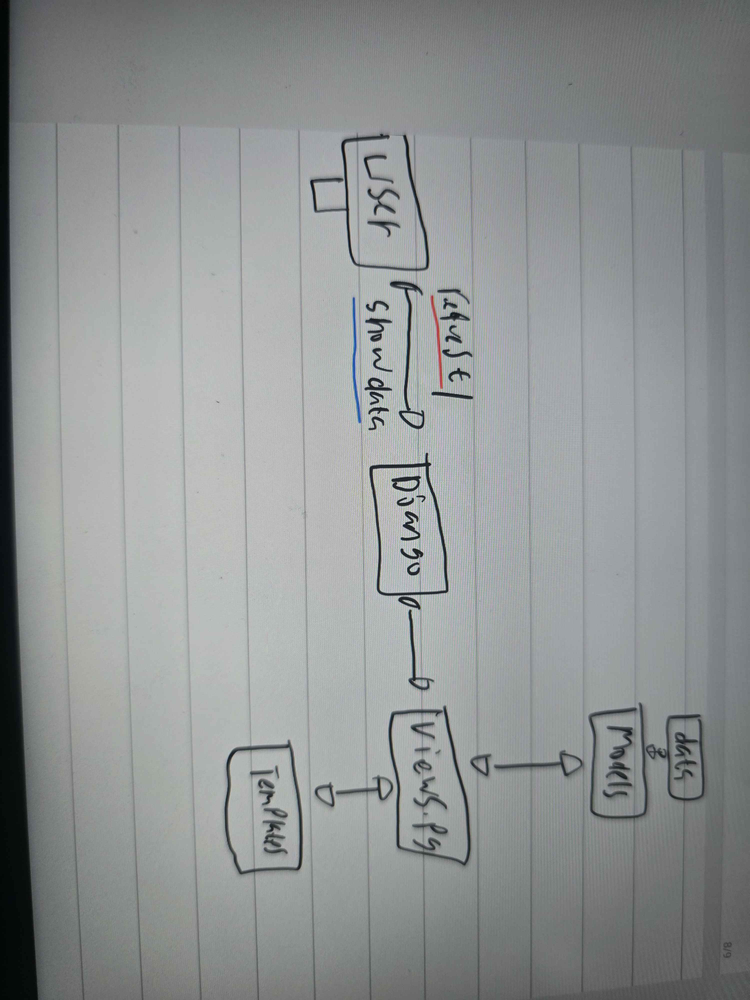

 Membuat sebuah README.md yang berisi tautan menuju aplikasi PWS yang sudah di-deploy, serta jawaban dari beberapa pertanyaan berikut.

 Name: Edward Jeremy Worang
 NPM: 2406359475

 1. Jelaskan bagaimana cara kamu mengimplementasikan checklist di atas secara step-by-step (bukan hanya sekadar mengikuti tutorial).

 Secara ringkas:

 kita buat repository di github dulu dan buat proyek baru di PWS dengan nama Aplikasi yang unik, dan nanti
 jangan lupa untuk diinit dan isi requirement.txt dependencies untuk mensetup djangonya

Terus kita membuat proyek django baru dengan key word django-admin startproject nama proyekk

Kedua kita membuat aplikasi main, kenapa kita buatnya? Untuk memisahkan domain aplikasi yaitu product
ke dalam app, memudahkan modularitas, testing dan juga reusability menurut saya ini mirip seperti OOP

kita buat Routing proyek dan aplikai produk dengan kata kunci path('', include('main.urls')),
analoginya adalah seperti berikut, 

Routing proyek = mengarahkan kamu dari pintu masuk mall ke toko yang benar.
Routing aplikasi = mengarahkan kamu di dalam toko ke bagian yang kamu cari.

keempat buat model product, sesuai sepesifikasi dari tugas, mirip seperti OOP ketika belajar di DDP1

Kelima migrasi database, kata kunci makemigrations dan migrate, setiap kali kita update DB atau model kita
harus jalankan perintah ini agar bisa direfleksikan kepada web.

Keenam, Views: Buat fungsi show_main(request) yang nanti akan dirender dan kirim datanya contextnya seperrti app_name. Template: Menampilkan data tersebut, kita memisahkan logika yaitu views dan presentasi yaitu template

Ketujuh, kita implementasikan routing apda main/urls.py

Kedelapan, registrasi model Product di main/admin.oy agar data bisa diisi atau diubah lewat
django admin

Terakhir kita lakukan deployment, secara ringkas, kita ambil dulu link dari PWS dimana kita buat proyek kedua kita
terus kita taruh link tersebut di allowed_host agar proyek kita bisa dilihat melalui domain pacil.
Terus setelah semua sudah kelar kita git push di web dan git push ke PWS.

2. Buatlah bagan yang berisi request client ke web aplikasi berbasis Django beserta responnya dan jelaskan pada bagan tersebut kaitan antara urls.py, views.py, models.py, dan berkas html.

Kita mulai dari sisi usernya yaitu ketika melakukan request, misal enter link website kita, terus di django(URL dispatcher) Mendaftar pola URl view mana yang harus dipanggil, ada root urls.py milik proyek yang include urls.app
yaitu milik app main kita.

Tearus lanjut ke views.py, ini menenerima request, memanggil model bila perlu atau juga mempersiapkan
suatu context lalu menrender ke template yang berbasis HTML dalam kasus proyek kita.

Models.py definsi struktur data dan relasi tabel, dimana view bisa memanggil model kita untuk lakukan
query, insert, update, atau delete 

Template HTML, file .html yang dirender oleh view dengan context(data) dan nanti yang akan ditampilkan
kepada user.

3. Jelaskan peran settings.py
settings.py adalah dimana kita konfigurasi proyek, perannya meliputi:
-Daftar app yang aktif pada installed apps variable
-Konfigurasi databases
-Mengatur templates
-Static dan Media settings dimana lokasi file statis dan media
-Allowed Host, debug dan seceret key dimana kita bisa mengaturkan keamanan dan environment
Secara rangkum settings.py mengontrol bagaimana aplikasi berjalan dan berinteraksi dengan lingkungan eksternal

4. Bagaimana cara kerja migrasi database di Django?
Perubahan model (mis. tambah field total_sold) ditulis di models.py.

Jalankan python manage.py makemigrations — Django membuat file migration baru (kode Python yang mendeskripsikan perubahan DB: AddField, CreateModel, dsb.).

Jalankan python manage.py migrate — Django menjalankan operasi-oprasi yang terdapat di migration file pada database aktual.

5. Mengapa Django?
Menurut saya karena Django menyertakan banyak fitur yang membuat pelajar dapat membangun aplikasi nyata cepat
tanoa memilih dan mengintegrasi banyak paket. Terus juga bisa implementasikan struktur yang teroganisir yaitu
MVT template dan juga sebagai tambahan banyak pemula ketika belajar pemrograman mulai dari bahasa python dulu
sehingga django bisa jadi choice yang baik, terus juga komunitas django besar sehingga banyak resources.

6. Semua sudah perfect si, saya harap asisten dosen tetap konsistent dalam pekerjaannya dan juga semangat 
terus untuk mengajar kita (thumbs up).
